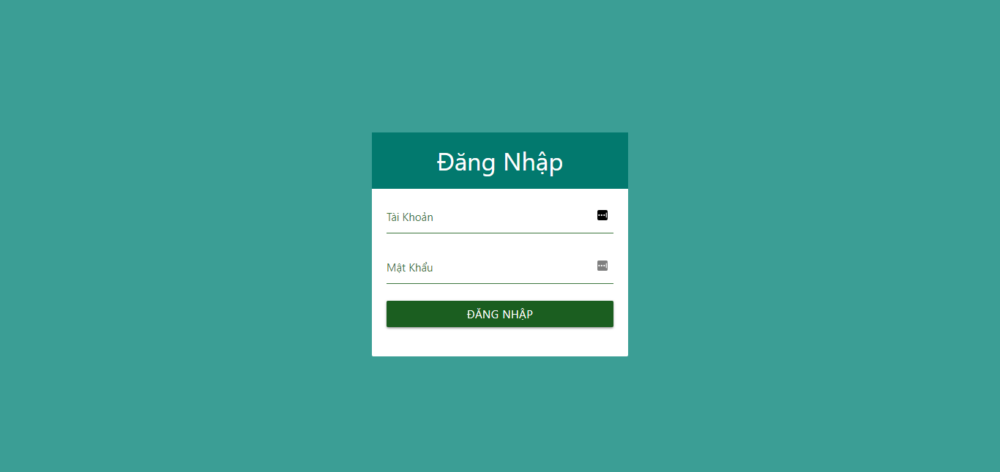
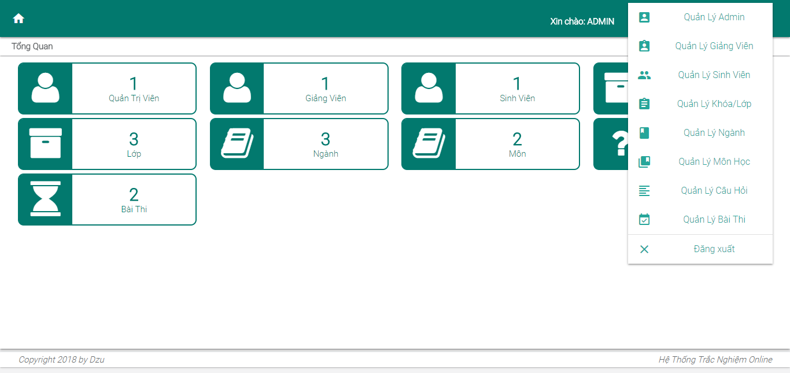
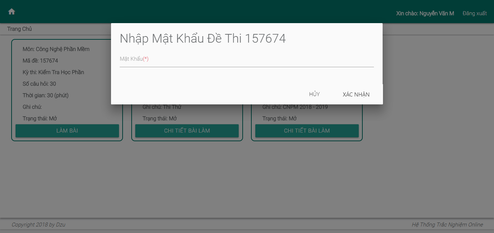
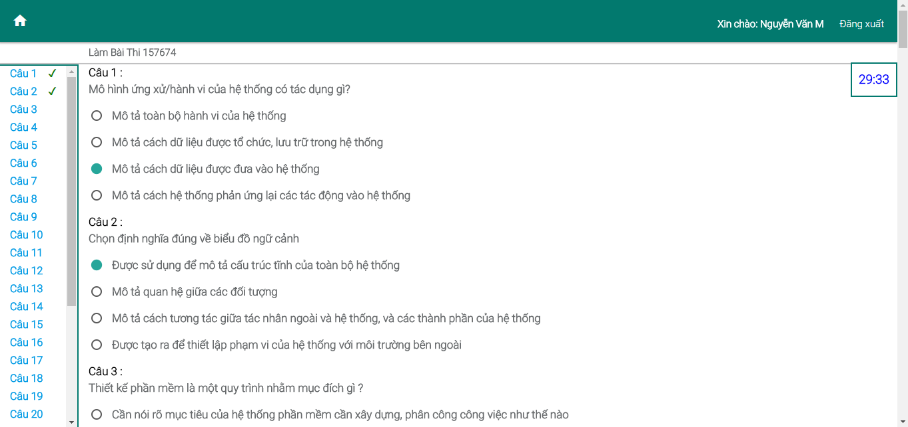
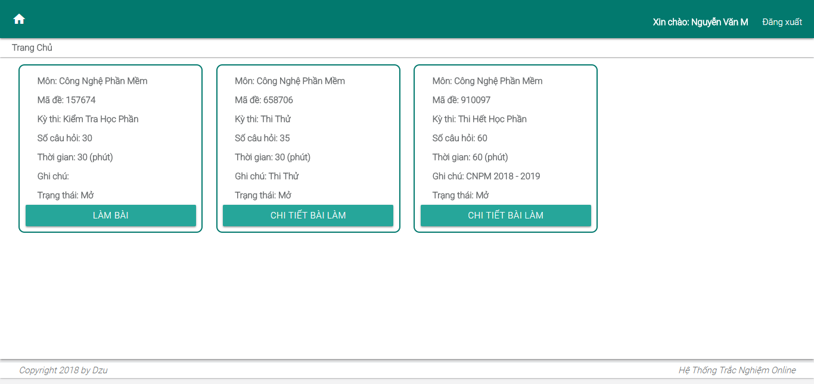
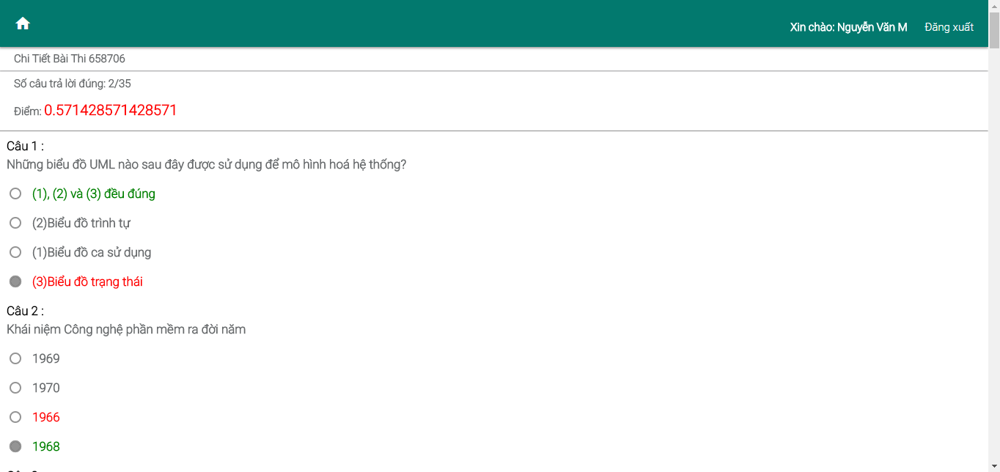
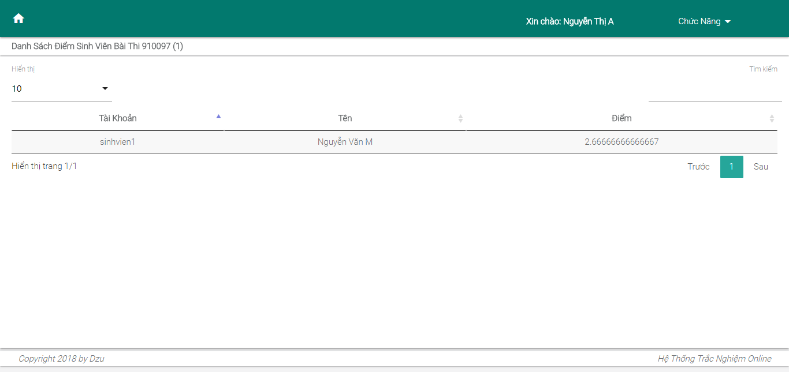
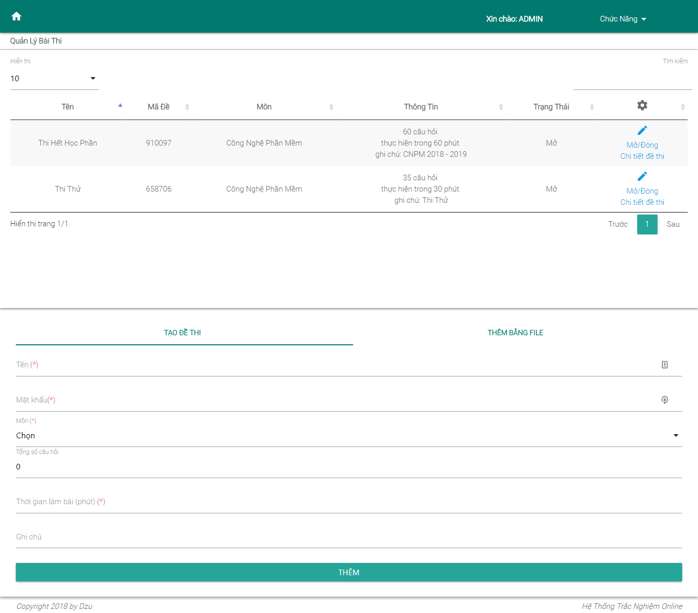

# Hệ Thống Trắc Nghiệm Online ASP.NET MVC

## Lưu ý 
Do database trước mình export bị thiếu nên chỉ có mỗi schema, mọi người import rồi tự vô bảng admins để thêm 1 record admin nhé. Với mật khẩu là chuỗi mã hóa md5 là đăng nhập được. Sau khi đăng nhập được admin thì sẽ thêm được dữ liệu khác
## Tính Năng
Sinh Viên:

	- Xem các bài thi
	- Làm các bài thi đang mở
	- Xem lại bài thi đã làm
Giảng Viên:

	- Xem danh sách sinh viên và điểm của bài thi
Admin:

	- Quản lý các thông tin
	- Tạo đề thi
	...

Xem thêm tại [CHANGELOG](CHANGELOG.md) 
[Hướng dẫn sử dụng](GUIDE.md)
## Sắp Có
Coming soon...
## Ảnh Demo 

